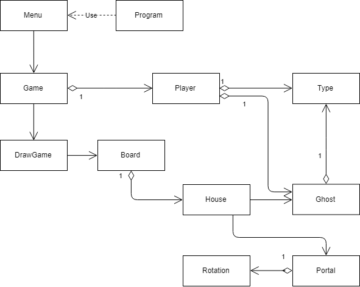
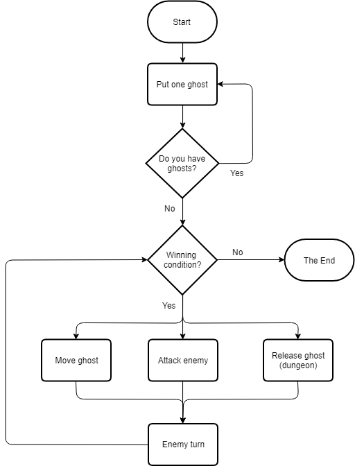

# **18 Ghosts**

## Who did the project
* __Diana Noia__ > __a21703004__ <

* __Sara Gama__ > __a21705494__ <
 
## Contact
* [GitHub](https://github.com/DianaNoia/18Ghosts)

## Who did what
__Diana Noia__
-> Program, DrawGame, House, Board, Game, Player, Portal, UML, Rotation, Type,
Ghost, comments.

__Sara Gama__
-> Program, Menu, Game, DrawGame, DrawBoard, Type, Board, comments, Doxygen,
Rotation, Type.

## Our solution
-> We started by hunderstanding the game in paper. Then we connected the class 
Program with the class Menu, here we made the Menu body. Here we connected each 
point to it's method.

In the class Game begins the GameLoop to draw the board in the class DrawGame 
in each time we start a game. 

In the other hand there is the class House that will have a color, mirror, 
a Portal and initiates the class Ghost, where it has color and a enumeration 
for the two types of the ghosts, in the Portal we also got a color and another 
enumeration but for the rotation. ChangeColor has the color base of the game 
and mirror is a bool, so it either exists or doesn't in the house.

### UML

Format: 

### Flowchart

Format: 

### Conclusions
__Diana Noia__ 
-> Thanks to this project I now know how to organize a project using classes, 
and how each one has variables, properties, constructors and methods. The 
comments are also important to organize the code, share it and understand it. I 
also understand better how the classes are called.

__Sara Gama__
-> As for me, I understand better how to organize a project, making it simple 
and direct so that everybody understands whats written and the connections 
between the classes. How to connect classes; changing the position in the game 
apresentation; enumerations; put color in the board and the pieces.

### References
* Powerpoints provided by the teacher.
* [StackOverFlow](https://stackoverflow.com/)